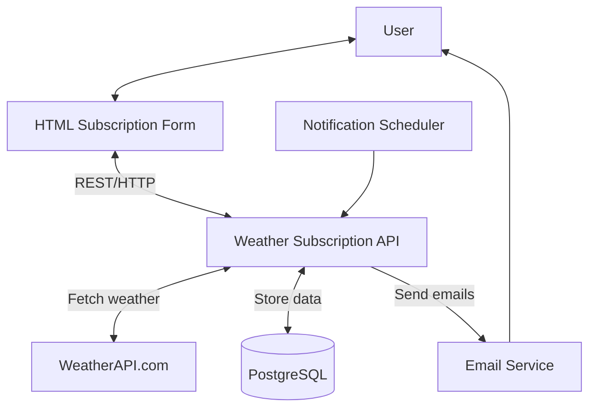
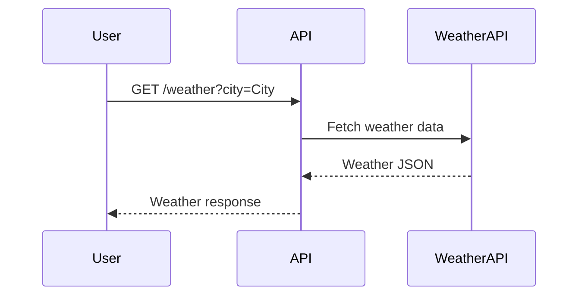
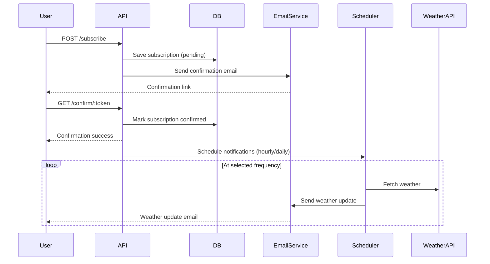
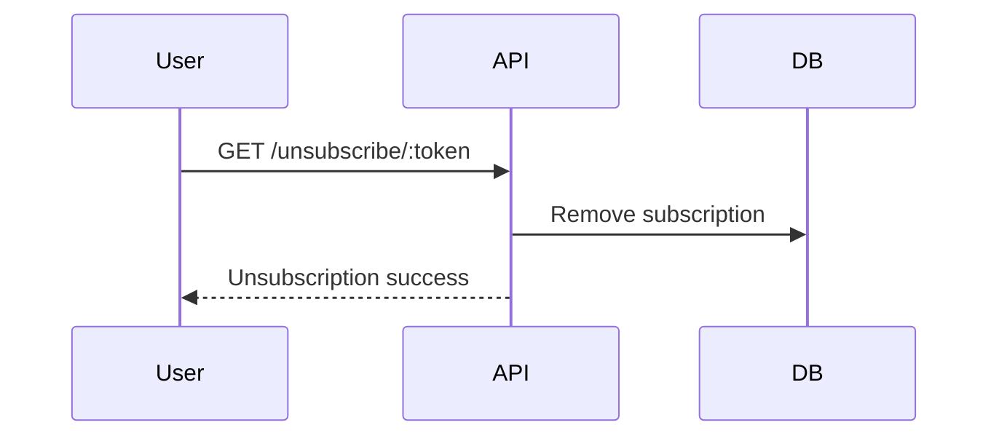
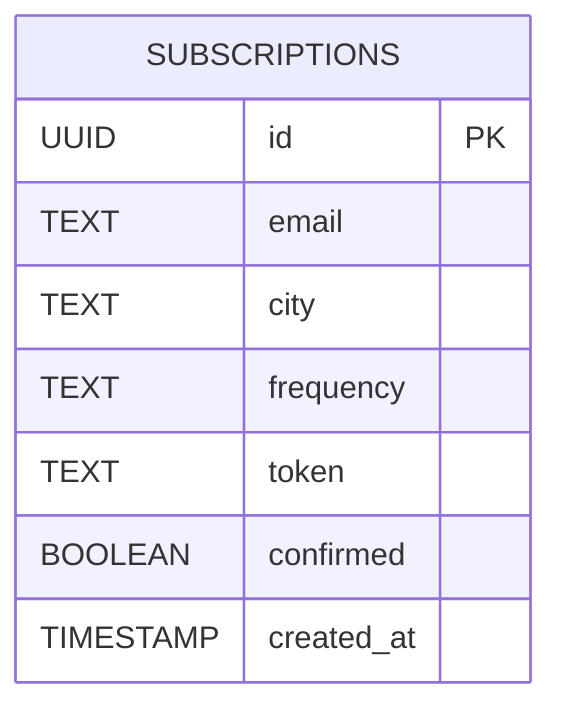

# System Design: Weather Subscription API

## 1. System Requirements

### Functional Requirements:

- Retrieve current weather data for a given city from a third-party API (weatherapi.com).
- Allow users to subscribe to weather updates for specific cities with special frequency (daily or hourly).
- Send a confirmation email containing a unique `token` immediately after successful subscription.
- Confirm user subscriptions via a unique `token` sent in the confirmation email.
- Ensure that the token is not expired within 24 hours of subscription.
- Ensure that users can only subscribe to a city once, preventing duplicate subscriptions.
- Send weather updates to subscribed users via email based on their subscription frequency.
- Allow users to unsubscribe from weather updates at any time.

### Non-Functional Requirements:

- **Availability**: The system should be available 99.9% of the time.
- **Scalability**: The system should support up to 150,000 active subscriptions and 500,000 confirmation/unsubscribe per
  day.
- **Latency**: P95 < 150ms for retrieving weather data; P95 < 200ms for subscription operations (excluding outbound
  email latency).
- **Security**: All traffic must use HTTP connection.
- **Data Integrity**: Composite uniqueness constraint (email, city) enforced in DB; migrations managed by Prisma.
- **Maintainability**: Code should be modular, with clear separation of concerns between API, service, and data access
  layers.
- **Testability**: The system should be easily testable with unit and integration tests. The core **functionality**
  should have over 90% unit tests coverage.
- **Observability**: Structured JSON logs. **Datadog** as the central sink for logs, metrics, and APM dashboards with
  alerting rules.

### Constraints:

- **Budget**: Minimal budget for third-party services, AWS infrastructure, and email delivery.
- **Weather API Limitation**: 1000 requests per hour for [weatherapi.com](https://www.weatherapi.com/).
- **EU Data Residency**: All user PII and weather snapshots must be stored in EU‑hosted RDS to meet GDPR **locality**
  requirements.
- **HTTPS Only**: All external endpoints must enforce HTTPS; plain HTTP requests are rejected.
- **Frequency Options**: Only `hourly` and `daily` frequencies are supported; custom intervals are out of scope.

## 2. Load & Traffic Estimation

### Users & Traffic

- **Active users**: 50 000.
- **Average subscriptions per user**: 2-3.
- **Peak API requests**: 1 000 RPS.
- **Email messages sent**: ~500 000 / day.

### Data Footprint

- **User record**: ≈ 200 bytes.
- **Subscription record**: ≈ 300 bytes.
- **Total storage growth**: ≈ 100 GB / year.

### Bandwidth

- **Incoming (user requests)**: ≈ 1 Mbps.
- **Outgoing (email delivery)**: ≈ 10 Mbps.
- **External API calls (Weather API)**: ≈ 50 Mbps peak.

## 3. High-Level Architecture



## 4. Design Components

### 4.1. Weather Service

* **Responsibilities**:
    - Fetch current weather data from WeatherAPI.com
    - Transform external JSON into internal DTO (GetWeatherResponse)
    - Provide weather data to Notification Worker (NotificationService)
* **Endpoints**:
    * `GET /weather?city={city}` - retrieves current weather for a given city.
* **Technologies**:
    - **NestJS with TypeScript** for building the service.
    - **Native fetch** for making HTTP requests to WeatherAPI.com.
    - **class‑transformer** for type mapping.
    - **WeatherAPI.com** for external weather data.

### 4.2. Subscription Service

* **Responsibilities**:
    - Handle user subscriptions (create, confirm, unsubscribe).
    - Validate subscription uniqueness (email, city).
    - Generate confirmation UUID tokens.
    - Validate token expiration (24 hours).
    - Store subscription data in PostgreSQL via repository pattern.
    - Send confirmation emails with unique tokens via EmailService.
* **Endpoints**:
    * `POST /subscribe` - create a new subscription.
    * `GET /confirm/:token` - confirm a subscription using a token.
    * `GET /unsubscribe/:token` - unsubscribe using a token.
* **Technologies**:
    - **NestJS with TypeScript** for building the service.
    - **Prisma ORM** for database access (SubscriptionRepository).
    - **class-validator** for DTO validation.
    - **node:crypto** for UUID tokens.

### 4.3. Database Service

* **Responsibilities**:
    - Store subscription data.
    - Ensure data integrity with composite uniqueness constraints (email, city).
    - Handle migrations using Prisma.
    - Implement CRUD + query helpers using Prisma Client.
* **Schema**:
    * `subscriptions` table:
        * id: UUID (Primary Key)
        * email: TEXT NOT NULL
        * city: TEXT NOT NULL
        * frequency TEXT NOT NULL
        * token TEXT NOT NULL
        * confirmed BOOLEAN NOT NULL DEFAULT false
        * created_at TIMESTAMP NOT NULL DEFAULT NOW()
* **Technologies**:
    - **PostgreSQL** for relational data storage.
    - **Prisma ORM** for schema management and data access.
    - **NestJS Custom Providers** (e.g., `PrismaService` extending `PrismaClient`).

### 4.4. Email Service

* **Responsibilities**:
    - Send confirmation emails with unique tokens.
    - Send weather updates based on subscription frequency.
* **Methods**:
    * `sendConfirmationEmail(email: string, token: string)` - sends confirmation email.
    * `sendWeatherUpdate(email: string,
      city: string,
      weather: GetWeatherResponse,
      frequency: string)` - sends weather update email.
* **Technologies**:
    - **Nodemailer** for sending emails.
    - **NestJS Mailer Module** for integration with NestJS.
    - **Handlebars** for templating email content.
* **Templates**:
    - Confirmation email template with token link (`confirm.hbs`).
    - Weather update email template with current weather data (`weather-update.hbs`).

### 4.5. Notification Scheduler (Notification Service)

* **Responsibilities**:
    - Schedule and send weather updates based on subscription frequency.
    - Delegates the main logic to `EmailJobService.sendWeatherEmailsByFrequency()` with hourly or daily label.
    - Log success/failure to console.
* **Methods**:
    * `@Cron(EVERY_HOUR) -> sendHourlyEmails()` - schedules hourly updates.
    * `@Cron(EVERY_DAY_AT_8AM) -> sendDailyEmails()` - schedules daily updates.
* **Technologies**:
    * **@nestjs/schedule** for cron jobs.

## 5. Deployment Strategy

* **Environment**: AWS (EC2, RDS).
* Configure **Resend** account for sending emails.
* Use **AWS RDS** for PostgreSQL with EU data residency.
* **Containerize** the application with a multi‑stage Dockerfile.
* Build and push Docker images to **Amazon ECR**.
* Pull the image from ECR to **AWS EC2** with Docker Engine installed.
* Run the container with environment variables for configuration.
* Automate **CI/CD** with GitHub Actions: lint -> test -> build -> push -> SSH into VPS and execute the
  two `docker pull` & `docker run` commands.
* Configure **Datadog** for logging, metrics, and APM. Add alerting rules for critical errors and performance issues.

## 6. Testing Strategy

### Unit Tests

Unit tests will focus on individual components and services to ensure their correctness in isolation. The scope: test
core business logic, DTO validation, and service methods.

#### Key Areas to Test:

* **Weather Service**:
    * Validate transformation of external API responses into internal DTOs.
    * Ensure proper error handling for invalid city names or API failures.
* **Subscription Service**:
    * Verify subscription creation, confirmation, and uniqueness constraints.
    * Test token expiration logic and exception handling.
* **Notification Service**:
    * Test scheduled tasks for hourly and daily email dispatch.

### Integration Tests

Integration tests will validate the interaction between multiple components and services to ensure they work together as
expected. The scope includes testing service-to-service communication, database operations.

#### Key Areas to Test:

* **Subscription Service**:
    * Test database operations for subscription creation, confirmation, and deletion.
    * Validate email sending logic with mocked email service.
* **Notification Service**:
    * Ensure scheduled tasks trigger the correct email dispatch logic.
    * Test logging of success and failure cases during email dispatch.

### End-to-End Tests

End-to-End tests verify complete user journeys through HTTP interface -> business services -> PostgreSQL -> e-mail
outbox,
using stubs for external providers.

#### Key Areas to Test:

* **User Subscription Flow**:
    * Test the entire flow from submitting a subscription form to receiving a confirmation email (Subscription
      lifecycle — `POST /subscribe` -> `confirmation e-mail` -> `GET /confirm/{token}` -> `scheduled e-mail` -> `GET
      /unsubscribe/{token}`).

## 7. Future Enhancements

* **User authentication & authorization**:
    * Implement user accounts with JWT-based authentication to manage subscriptions securely.
    * Plus add user roles (admin, user) for better access control.
    * Add Google OAuth2 login for easy user registration.
    * Add user profile management (update email, password, etc.).
* **Delivery Channels**:
    * Add support for SMS notifications using Twilio or similar service.
    * Implement push notifications for mobile devices.
* **Localization**:
    * Add support for multiple languages in email templates.
* **Real-time Updates**:
    * Implement WebSocket or Server-Sent Events (SSE) for real-time weather updates.
* **Caching**:
    * Implement caching for weather data to reduce API calls and improve response times.
* **Observability**:
    * Add more detailed metrics and APM traces for better performance monitoring.
    * Add alerting rules for critical errors and performance issues in Datadog.

## 8. Sequence Diagrams

### 8.1 Get Weather



### 8.2 Subscribe to Weather Updates



### 8.3 Unsubscribe from Weather Updates



## 9. Entity Relationship Diagram



## 10. API Examples

### GET /weather?city=London

**Response**

```json
{
  "temperature": 21,
  "humidity": 40,
  "description": "Partly cloudy"
}
```

### POST /subscribe

**Request**

```json
{
  "email": "user@example.com",
  "city": "London",
  "frequency": "daily"
}
```

**Response**

```json
{
  "message": "Subscription successful. Confirmation email sent."
}
```

### GET /confirm/{token}

**Response**

```json
{
  "message": "Subscription confirmed successfully"
}
```

### GET /unsubscribe/{token}

**Response**

```json
{
  "message": "Unsubscribed successfully"
}
```